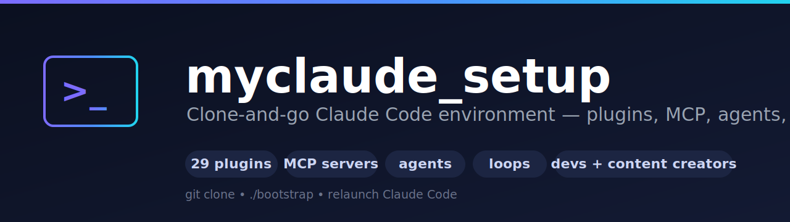

<p align="center">
  
</p>

# myclaude_setup

One-command replication of a full **Claude Code** environment — plugins, MCP servers,
agents, skills, hooks, and baseline settings — on any new machine or new Claude
subscription. **Config only. No project/application code.**

> Everything here lives in `~/.claude` (per OS user), **not** in your Claude subscription.
> Plugins/MCP/hooks are machine-local; only claude.ai *connectors* (e.g. Microsoft Learn)
> are account-scoped and enabled in the claude.ai UI.

---

## TL;DR

```bash
git clone https://github.com/sachinbhatela/myclaude_setup.git
cd myclaude_setup

# Windows
powershell -ExecutionPolicy Bypass -File bootstrap.ps1
# macOS / Linux
bash bootstrap.sh

# then: relaunch Claude Code — the 29 plugins install automatically
```

---

## What you get (capabilities)

**6 marketplaces → 29 plugins**, grouped by what they do:

### Behavior / prose styles (auto-activate via SessionStart hooks)
| Plugin | Capability |
|---|---|
| **caveman** | Terse "smart caveman" prose — strips filler, keeps all technical substance. Toggle `/caveman lite\|full\|ultra`. |
| **ponytail** | "Lazy senior dev" code discipline — YAGNI, reuse-first, shortest working diff, marks corner-cuts. Toggle `/ponytail lite\|full\|ultra`. |

### Core dev workflow (Anthropic official)
| Plugin | Capability |
|---|---|
| **superpowers** | Brainstorming, TDD, systematic-debugging, writing/executing plans, code-review, worktrees |
| **code-review** | Review a diff/PR for correctness + cleanups (`/code-review`) |
| **code-simplifier** | Refactor for clarity without changing behavior |
| **coderabbit** | AI code review (`/coderabbit-review`) |
| **claude-md-management** | Audit + improve `CLAUDE.md` project memory |
| **claude-code-setup** | Recommend hooks/agents/skills/MCP for a repo |
| **plugin-dev** | Build Claude Code plugins, agents, skills, hooks |
| **mcp-server-dev** | Scaffold MCP servers / apps / MCPB bundles |
| **hookify** | Turn "don't do X again" into enforced hooks |
| **playground** | Generate interactive single-file HTML explorers |
| **atomic-agents**, **rust-analyzer-lsp** | agent-framework helper; Rust LSP intelligence |

### Cloud / infrastructure
| Plugin | Capability |
|---|---|
| **azure** | Azure ops across ~80 tools (AKS, Cosmos, Storage, KeyVault, Monitor, AI Foundry, cost, RBAC…) + best-practice skills |
| **terraform** | Terraform / IaC authoring + Azure Terraform best practices |

### Frontend / design
| Plugin | Capability |
|---|---|
| **frontend-design** | Frontend design guidance |
| **figma** | Figma design-to-code, diagrams, Code Connect (+ MCP) |
| **motion** | Figma motion / animation |
| **vercel** | Next.js, AI SDK, deploys, storage, firewall (+ MCP + agents) |
| **ui-ux-pro-max** | 50+ styles, 161 palettes, font pairings, component specs, shadcn |
| **stitch-build / stitch-design / stitch-utilities** | Google Stitch design → React/RN/shadcn code |

### Data / AI / APIs / knowledge
| Plugin | Capability |
|---|---|
| **context7** | Live, version-accurate library/framework docs (MCP) |
| **huggingface-skills** | Models, datasets, Spaces, training, LoRA (+ MCP) |
| **postman** | API testing, collections, mocks, OWASP security scan (+ MCP + agents) |
| **qodo-skills** | Qodo code-quality rules + PR resolver |
| **obsidian-second-brain** | Operate an Obsidian vault as a self-rewriting knowledge base (+ MCP) |

### MCP servers included
- **serena** — code-intelligence MCP (symbol search, refs, edits). Installed + registered by the bootstrap (`uv tool install`).
- **Plugin MCPs** — azure, context7, figma, huggingface, obsidian, postman, vercel ship inside their plugins (no separate install).
- **claude.ai connectors** (account-scoped, manual) — **Microsoft Learn** (grounded MS/Azure docs) + optional Atlassian, Notion, Figma, Microsoft 365, Vercel.

### Ready-made agents + task automation
Starter **subagents** (installed to `~/.claude/agents/` by the bootstrap) plus loop/scheduling
recipes — see **`AGENTS-AND-LOOPS.md`**:
| Agent | Audience | Does |
|---|---|---|
| **dev-code-reviewer** | dev | review a diff/PR for bugs, security, missing tests (read-only) |
| **dev-test-author** | dev | write + run focused tests matching your framework |
| **content-writer** | creator | draft/edit posts, docs, copy in a given voice (cites facts) |
| **content-researcher** | creator | topic → cited brief (facts, timeline, contrarian views) |

Plus **loops** (`/loop` — recurring/self-paced tasks), **scheduled agents** (`/schedule` — cron),
and an **add-on install guide** for pulling in more agents/skills/plugins/MCP when something
isn't bundled. All in `AGENTS-AND-LOOPS.md`.

### Baseline settings applied
`model: opus[1m]`, `effortLevel: xhigh`, `permissions.defaultMode: auto`, `autoUpdatesChannel: latest`
(only set if not already present — your existing choices are preserved).

---

## Prerequisites

| Tool | Needed for | Install (Windows) |
|---|---|---|
| **Claude Code CLI** | everything | per Anthropic docs (`claude` on PATH) |
| **Python 3.10+** | the config merge in bootstrap | `winget install Python.Python.3.12` |
| **uv** | serena (auto-installed by bootstrap if missing) | bootstrap handles it |
| **git** | clone | `winget install Git.Git` |
| Azure CLI `az`, **Terraform** | only for Azure/IaC work | `winget install Microsoft.AzureCLI Hashicorp.Terraform` |
| Node.js / npx | only if you use the `ruflo` project MCP | `winget install OpenJS.NodeJS.LTS` |
| GitHub CLI `gh` | optional (PRs) | see `ONBOARDING.md §5` (zip fallback for Windows Server) |

macOS/Linux: use `brew` / apt.

---

## Setup — end to end from a bare VM

You're a brand-new Claude user on a fresh machine. Do these in order:

1. **Install Claude Code + sign in.** Install the Claude Code CLI (per Anthropic docs) and
   run `claude` → sign in to **your Claude subscription** (the account gives you model
   access; it does NOT carry any plugins — that's what this repo is for).
2. **Install the base tools** the bootstrap needs: **git** and **Python 3.10+**
   (`winget install Git.Git Python.Python.3.12`). `uv` is auto-installed by the bootstrap.
3. **Clone this repo + run the bootstrap:**
   ```bash
   git clone https://github.com/sachinbhatela/myclaude_setup.git
   cd myclaude_setup
   powershell -ExecutionPolicy Bypass -File bootstrap.ps1     # Windows
   # bash bootstrap.sh                                        # macOS/Linux
   ```
   The bootstrap:
   - merges `claude-settings.snippet.json` into `~/.claude/settings.json` (backs up first, idempotent),
   - installs `uv` + **serena** and registers it as a user MCP,
   - copies the bundled **agents** (`agents/*.md`) into `~/.claude/agents/`,
   - prints the remaining manual steps.
4. **Relaunch Claude Code** — it installs all 29 plugins on next launch. `caveman` and
   `ponytail` announce themselves at session start (that's your confirmation it worked).
5. **Enable claude.ai connectors** (only on a new subscription): claude.ai → Settings →
   Connectors → enable **Microsoft Learn** (+ any others). These are account-scoped, so they
   don't come from this repo.
6. **Azure / IaC work (optional):** install `az` + Terraform (`winget install
   Microsoft.AzureCLI Hashicorp.Terraform`), then `az login --tenant <TENANT_ID> --use-device-code`.
   ⚠️ If `terraform plan` hits `AADSTS50076 … multi-factor authentication … 00000003-…`
   (Microsoft Graph), apply the **WAM-broker / step-up-MFA fix in `ONBOARDING.md §3`**.
7. **Per-project rules (optional):** drop a `CLAUDE.md` in any repo you work in so Claude
   follows that project's conventions. Nothing else is per-project.

**What you end up with:** 29 plugins + serena/Microsoft-Learn MCP + caveman/ponytail styles
+ (if installed) a working `az`/Terraform toolchain — identical to the source machine.

Re-running the bootstrap is safe (idempotent — adds only what's missing).

---

## Verify

```bash
# in a Claude Code session:
/caveman          # confirms caveman plugin loaded (shows mode)
/ponytail         # confirms ponytail loaded
/plugin           # lists all installed plugins
# trigger Microsoft Learn or serena with a question to confirm MCP
az account show           # Azure auth (if used)
terraform -version        # (if used)
```
Green when: caveman/ponytail auto-activate · `/plugin` lists 29 · serena + Microsoft Learn respond · `az`/`terraform` work.

---

## Files

| File | Purpose |
|---|---|
| `bootstrap.ps1` / `bootstrap.sh` | one-shot setup (config merge + uv/serena + serena MCP) |
| `apply_config.py` | idempotent, non-destructive merge into `~/.claude/settings.json` (`--dry-run` supported) |
| `claude-settings.snippet.json` | source of truth: 6 marketplaces + 29 enabled plugins + baseline |
| `ONBOARDING.md` | full reference: every tool, MCP, auth flow, and the Azure MFA/WAM gotcha |
| `SCOPE-AND-USAGE.md` | what's global vs project vs account, and what's used **automatically** vs manually |
| `AGENTS-AND-LOOPS.md` | bundled agents, how to build/install your own, loops (`/loop`), scheduling (`/schedule`), add-on install guide |
| `agents/*.md` | 4 ready-made subagents (2 dev, 2 content) — copied to `~/.claude/agents/` by the bootstrap |
| `README.md` | this overview |

---

## How it works / notes

- **Machine-local, not subscription-bound.** Plugins/MCP/skills/agents/hooks persist across
  Claude-account switches (same OS user). Only claude.ai *connectors* are per-account.
- **Marketplaces** pulled from GitHub: `anthropics/claude-plugins-public`,
  `nextlevelbuilder/ui-ux-pro-max-skill`, `eugeniughelbur/obsidian-second-brain`,
  `DietrichGebert/ponytail`, `JuliusBrussee/caveman`, `google-labs-code/stitch-skills`.
- **Non-destructive:** `apply_config.py` only adds missing keys and backs up
  `settings.json` before writing. Existing settings/plugins are untouched.
- **serena** re-indexes whatever project you open — automatic, no per-repo config.
- **What's global and what auto-fires** — see **`SCOPE-AND-USAGE.md`**: tooling (plugins/MCP/
  skills/agents/hooks) is global and Claude auto-invokes it when your task needs it; hooks
  (caveman/ponytail) are always-on; only `CLAUDE.md`/state is per-project; connectors per-account.

## Troubleshooting

| Symptom | Fix |
|---|---|
| Plugins didn't install | Fully relaunch Claude Code; check `~/.claude/settings.json` has the `enabledPlugins` block |
| `python not found` in bootstrap | Install Python 3.10+, re-run bootstrap |
| serena not available | Ensure `uv` on PATH, then `uv tool install git+https://github.com/oraios/serena` + `claude mcp add serena --scope user -- serena start-mcp-server --context claude-code --project-from-cwd` |
| Microsoft Learn / connector missing | Enable it in claude.ai → Connectors (account-scoped, not in this repo) |
| Azure `AADSTS50076` on plan | `ONBOARDING.md §3` — disable WAM broker + re-login with Graph scope + complete MFA |
